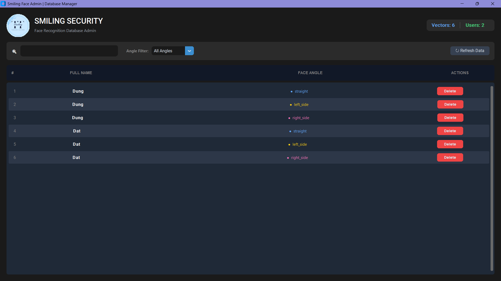

<div align="center">

# 🔐 SecureFaceID

### Real-time Face Recognition with Anti-Spoofing Protection

[](https://python.org)
[](https://opencv.org)
[](https://github.com/deepinsight/insightface)
[](LICENSE)

*A production-ready face recognition system with liveness detection to prevent photo/video spoofing attacks.*

---

</div>

## 🎬 Demo

### Real-time Face Recognition
> Watch how the system detects and recognizes faces in real-time with anti-spoofing protection.

https://github.com/Smiling-17/SecureFaceID/assets/demo_dectect.gif

<video src="assets/demo_dectect.gif" controls width="100%"></video>

### User Enrollment Process
> See the 3-step enrollment process: straight face → left turn → right turn

https://github.com/Smiling-17/SecureFaceID/assets/demo_enroll.gif

<video src="assets/demo_enroll.gif" controls width="100%"></video>

### Database Management Interface
> Modern dark-themed admin panel for managing registered users

<p align="center">
  
</p>

---

## ✨ Key Features

| Feature | Description |
|---------|-------------|
| 🎯 **Real-time Recognition** | Instant face detection and recognition via webcam |
| 🛡️ **Anti-Spoofing** | MiniFASNetV2-based liveness detection prevents photo/video attacks |
| 📐 **Multi-angle Enrollment** | 3-angle face capture (front, left, right) for robust recognition |
| 🎯 **Face Tracking** | IoU-based tracker maintains stable identity across frames |
| 📊 **Moving Average Scoring** | Smooth liveness decisions using 10-frame rolling average |
| ⚡ **GPU Acceleration** | CUDA support for high-performance inference |
| 🖥️ **Modern Admin UI** | Beautiful CustomTkinter interface for database management |

---

## 🏗️ System Architecture

```
+===========================================================================+
|                       SECURE FACE RECOGNITION                             |
+===========================================================================+
|                                                                           |
|  +----------+    +---------------+    +--------------+    +-------------+ |
|  |  Webcam  |--->| Face Detection|--->|   Liveness   |--->| Recognition | |
|  |  Input   |    |  (InsightFace)|    |  Detection   |    |   Engine    | |
|  +----------+    +---------------+    +--------------+    +-------------+ |
|                          |                    |                  |        |
|                          v                    v                  v        |
|                  +-------------+       +-------------+    +----------+    |
|                  |  Landmarks  |       |  Real/Fake  |    |  Match   |    |
|                  |  Extraction |       |    Score    |    | Database |    |
|                  +-------------+       +-------------+    +----------+    |
|                          |                    |                  |        |
|                          +--------------------+------------------+        |
|                                               |                           |
|                                               v                           |
|                                  +---------------------+                  |
|                                  |   Display Result    |                  |
|                                  |  Name + Confidence  |                  |
|                                  +---------------------+                  |
|                                                                           |
+===========================================================================+
```

---

## 📁 Project Structure

```
SecureFaceID/
│
├── 📂 configs/
│   └── config.yaml              # Main configuration file
│
├── 📂 core/                     # Core processing modules
│   ├── __init__.py
│   ├── database.py              # Database operations (CRUD)
│   ├── engine.py                # Face detection & embedding extraction
│   ├── liveness.py              # Anti-spoofing inference
│   └── utils.py                 # Helper functions & classes
│
├── 📂 data/                     # Stored user data
│   ├── face_names.json          # User names & face angles
│   └── face_vectors.npy         # 512-D embedding vectors
│
├── 📂 models/                   # Pre-trained models
│   ├── MiniFASNetV2.onnx        # Liveness detection model
│   └── models/
│       ├── buffalo_s/           # Lightweight face model (~127MB)
│       └── buffalo_l/           # High-accuracy face model (~288MB)
│
├── 📂 tools/                    # Utility scripts
│   ├── enroll_user.py           # User registration tool
│   └── manage_db.py             # Database admin GUI
│
├── 📂 assets/                   # Media assets
│   ├── logo.png
│   ├── demo_dectect.mp4
│   ├── demo_enroll.mp4
│   └── manage_db.png
│
├── demo_webcam.py               # 🚀 Main application
├── requirements.txt             # Python dependencies (pip)
├── environment.yml              # Anaconda environment file
├── .gitignore                   # Git ignore rules
└── README.md                    # This file
```

---

## 🔧 Installation

### Prerequisites

- **Python 3.9** (Required - other versions may cause compatibility issues)
- NVIDIA GPU with CUDA (optional, for faster inference)
- Webcam
- Anaconda/Miniconda (recommended) or pip

### Step 1: Clone the Repository

```bash
git clone https://github.com/Smiling-17/SecureFaceID.git
cd SecureFaceID
```

### Step 2: Set Up Environment

#### Option A: Using Anaconda (Recommended) ✅

This is the easiest way to ensure Python 3.9 and all dependencies are correctly installed.

```bash
# Create conda environment from file
conda env create -f environment.yml

# Activate the environment
conda activate securefaceid
```

#### Option B: Using pip + venv

> ⚠️ Make sure you have Python 3.9 installed before proceeding.

```bash
# Windows
python -m venv venv
venv\Scripts\activate

# Linux/macOS
python3.9 -m venv venv
source venv/bin/activate

# Install dependencies
pip install -r requirements.txt
```

### Step 3: Verify Installation

```bash
python -c "import insightface; import onnxruntime; import cv2; print('✅ All dependencies installed!')"
```

---

## 🚀 Usage

### 1️⃣ Enroll New User

Register a new user with 3 face angles for optimal recognition accuracy.

```bash
python -m tools.enroll_user
```

**Enrollment Process:**
| Step | Action | Visual Feedback |
|------|--------|-----------------|
| 1 | Look straight at camera | Keep stable for 50 frames |
| 2 | Turn head LEFT | Keep stable for 50 frames |
| 3 | Turn head RIGHT | Keep stable for 50 frames |

> 💡 **Tip:** Good lighting and a clear background improve enrollment quality.

### 2️⃣ Run Real-time Recognition

Start the main face recognition application.

```bash
python -m demo_webcam
```

**Recognition States:**
| Color | Status | Meaning |
|-------|--------|---------|
| 🔵 Blue | `Checking... X/10` | Collecting liveness samples |
| 🟢 Green | `[Name]` | Recognized user (live face) |
| 🟡 Yellow | `Unknown` | Live face, not in database |
| 🔴 Red | `Fake / Spoof` | Photo/video attack detected |

**Controls:**
- Press `Q` to quit the application

### 3️⃣ Manage Database

Open the GUI admin panel to view, search, and delete users.

```bash
python -m tools.manage_db
```

**Features:**
- 🔍 Search users by name
- 🎚️ Filter by face angle
- 🗑️ Delete user records
- 📊 View statistics (total vectors, unique users)

---

## 📖 Detailed Module Documentation

### `core/engine.py` - Face Analysis Engine

Handles face detection and feature extraction using InsightFace.

```python
from core.engine import face_analysis

result = face_analysis(image)
# Returns:
# {
#     'bbox': [[x1, y1, x2, y2], ...],      # Bounding boxes
#     'vector_emb': [512-D array, ...],     # Face embeddings
#     'landmark5': [5x2 array, ...]         # 5-point landmarks
# }
```

**Model Options:**
| Model | Size | Speed | Accuracy |
|-------|------|-------|----------|
| `buffalo_s` | ~127MB | Faster | Good |
| `buffalo_l` | ~288MB | Slower | Better |

### `core/liveness.py` - Anti-Spoofing Module

Detects whether a face is real or a spoofing attempt.

```python
from core.liveness import liveness_predict

is_real, real_score, fake_score, probs = liveness_predict(face_crop)
# is_real: Boolean (True if real face)
# real_score: Float [0-1] (probability of real)
# fake_score: Float [0-1] (probability of fake)
```

### `core/database.py` - Database Operations

Manages user data storage and retrieval.

```python
from core.database import load_db, add_user, delete_user

# Load existing data
vectors, names = load_db()

# Add new user
add_user(
    new_name={'name': 'John', 'face_angle': 'straight'},
    new_vector=embedding_512d
)

# Delete user (removes ALL angles for this name)
delete_user('John')
```

**Data Format:**
```json
// face_names.json
{
    "name": ["Alice", "Alice", "Alice", "Bob", "Bob", "Bob"],
    "face_angle": ["straight", "left_side", "right_side", "straight", "left_side", "right_side"]
}
```

### `core/utils.py` - Utility Functions

| Function/Class | Purpose |
|----------------|---------|
| `cosine_similarity(a, b)` | Compare two embedding vectors |
| `align_crop_5pts(img, kps5, size)` | Align face using 5 landmarks |
| `SimpleTracker` | Track faces across frames using IoU |
| `MovingAvgBuffer` | Smooth liveness scores over N frames |

---

## ⚙️ Configuration

Edit `configs/config.yaml` to customize the system:

```yaml
# Model paths
paths:
  model_face_root: ./models
  file_vectors: ./data/face_vectors.npy
  file_names: ./data/face_names.json

# Face detection model
model:
  model_name: 'buffalo_s'    # Options: 'buffalo_s', 'buffalo_l'
  det_size: 640              # Detection input size

# Recognition threshold
similarity_threshold: 0.6    # Higher = stricter matching (0.5-0.7 recommended)
scale_factor: 0.5            # Frame resize for faster processing

# Liveness detection
liveness:
  model_liveness_path: ./models/MiniFASNetV2.onnx
  input_size: 80
  liveness_threshold: 0.6    # Higher = stricter liveness check
  need_frames: 10            # Frames to average for decision

# Enrollment settings
enroll_user:
  yaw_thresh_left: 0.5       # Left turn detection ratio
  yaw_thresh_right: 1.5      # Right turn detection ratio
```

---

## 🔬 How It Works

### Recognition Flow

```
Frame Capture → Resize (50%) → Face Detection → Tracking (IoU)
                                     │
                                     ▼
                              Extract Landmarks
                                     │
                     ┌───────────────┴───────────────┐
                     ▼                               ▼
              Align & Crop Face              Extract 512-D Embedding
                     │                               │
                     ▼                               ▼
              Liveness Check                 Cosine Similarity Match
              (10-frame avg)                       │
                     │                             │
                     ▼                             ▼
              Real? ──────Yes────────────▶ Display Name
                │                          (if score ≥ 0.6)
                No
                │
                ▼
           Display "Fake/Spoof"
```

### Face Angle Detection Logic

```python
ratio = distance(nose, left_eye) / distance(nose, right_eye)

if ratio < 0.5:    → LEFT_SIDE
elif ratio > 1.5:  → RIGHT_SIDE  
else:              → STRAIGHT
```

---

## 🛠️ Tech Stack

| Component | Technology | Version |
|-----------|------------|---------|
| Face Detection | InsightFace (SCRFD) | ≥ 0.7.3 |
| Face Recognition | InsightFace (ArcFace) | ≥ 0.7.3 |
| Liveness Detection | MiniFASNetV2 | ONNX |
| Inference Runtime | ONNX Runtime | ≥ 1.16.0 |
| Computer Vision | OpenCV | ≥ 4.5.0 |
| GUI Framework | CustomTkinter | ≥ 5.2.0 |
| Data Storage | NumPy + JSON | - |

---

## 📊 Performance

| Metric | Value |
|--------|-------|
| Detection Speed | ~30 FPS (GPU) / ~10 FPS (CPU) |
| Recognition Accuracy | ~99.5% (LFW benchmark) |
| Liveness Accuracy | ~95%+ (internal testing) |
| Model Size | ~130MB (buffalo_s) |

---

## 🐛 Troubleshooting

### Common Issues

| Issue | Solution |
|-------|----------|
| `CUDA not available` | Install CUDA toolkit or use CPU-only mode |
| `No camera found` | Check webcam connection, try different index in `cv2.VideoCapture(0)` |
| `Model not found` | Ensure models are downloaded in `./models/` directory |
| `Low FPS` | Reduce `det_size` or use `buffalo_s` model |

### Performance Tips

1. **Use GPU**: Install `onnxruntime-gpu` for 3-5x speedup
2. **Reduce resolution**: Lower `scale_factor` in config
3. **Use lighter model**: Switch to `buffalo_s` instead of `buffalo_l`

---

## 🤝 Contributing

Contributions are welcome! Please feel free to submit a Pull Request.

1. Fork the repository
2. Create your feature branch (`git checkout -b feature/AmazingFeature`)
3. Commit your changes (`git commit -m 'Add some AmazingFeature'`)
4. Push to the branch (`git push origin feature/AmazingFeature`)
5. Open a Pull Request

---

## 📄 License

This project is licensed under the MIT License - see the [LICENSE](LICENSE) file for details.

---

## 🙏 Acknowledgments

- [InsightFace](https://github.com/deepinsight/insightface) - State-of-the-art face analysis toolkit
- [Silent-Face-Anti-Spoofing](https://github.com/minivision-ai/Silent-Face-Anti-Spoofing) - MiniFASNetV2 model
- [CustomTkinter](https://github.com/TomSchimansky/CustomTkinter) - Modern UI framework

---

<div align="center">

⭐ Star this repo if you find it useful!

</div>
